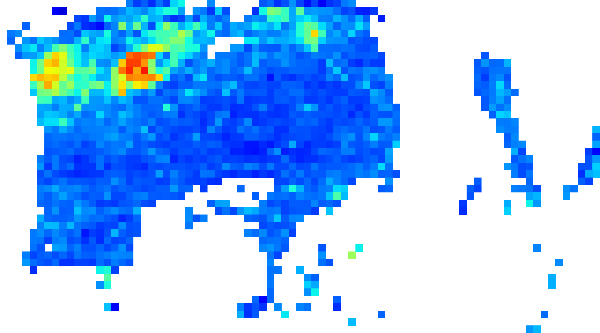

# Medical Image Classification with CNN — Breast Cancer Detection

## 🚀 Project Overview

This project aims to build a convolutional neural network (CNN) model to detect breast cancer from medical images. The model was trained and evaluated using a large dataset of labeled images **sourced from [Kaggle’s Breast Histopathology Images Dataset](https://www.kaggle.com/datasets/paultimothymooney/breast-histopathology-images)**, achieving promising accuracy and balanced precision/recall metrics.

---

## 🎯 Objectives

- Train a CNN model to classify images into cancerous and non-cancerous categories.
- Handle class imbalance with appropriate data splits and weighting.
- Evaluate model performance with metrics including AUC, accuracy, precision, recall, and F1 score.
- Visualize model decisions using Grad-CAM heatmaps for interpretability.
- Provide a clear workflow for preprocessing, training, evaluation, and visualization.

---

## 📊 Results Summary

| Metric    | Value |
| --------- | ----- |
| AUC       | 0.90  |
| Accuracy  | 84.5% |
| Precision | 69%   |
| Recall    | 78.5% |
| F1 Score  | 0.74  |

---

## 🖼️ Results & Deployment
### 🔬 Tumor Detection Output (Example)

Here is an example of a prediction made by the model with a corresponding heatmap:

### ⚙️ API & Docker Deployment

To make the model usable by clinicians or external systems, I developed a REST API using **FastAPI**. The API accepts histology images, processes them, and returns the classification result along with a heatmap highlighting potential tumor zones.

The full application is containerized using **Docker** for easy deployment and scalability. It was tested and deployed on an **AWS EC2 instance**, allowing remote access and facilitating integration in clinical workflows or research platforms.

The repo contains:
- `app/` folder with FastAPI logic
- `Dockerfile` for image building
- `notebooks/` to see the model creation steps

## 🛠️ Technologies & Tools

- TensorFlow / Keras for model building and training
- Python 3.8+
- Kaggle for dataset and notebook environment
- Matplotlib, OpenCV for visualization
- Git & GitHub for version control
- FastAPI and Docker for smooth deployement
---

